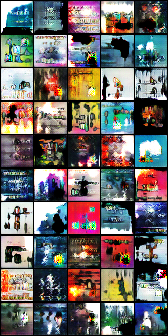

# Creating Album Cover Art using Generative Adversarial Networks(GANs)

This project began as my final projecct for the CS231N Class at Stanford but after failing to succeed 
in arriving to satisfactory results I continued to work on it in the weeks following the end of spring quarter.

This project builds utilizes the work of [Erik Linder-Norén](https://github.com/eriklindernoren/PyTorch-GAN/tree/master/implementations)
for implementations of wgan and acgan as well as the work of [Rafael Bidese](https://github.com/rafaelbidese/LOGAN) for implentation of the
LOGAN archirecture.

## Description

The objective of this project is to utilize state of the art GAN architectures on a newer more expansive image dataset in hopes of achieving state of the art performance in generating modern album cover art. In order to accomplish this, this project consists of two builds and a custom dataset. 

My exploration so far has led me to believe that a non-conditional GAN is more likely to produce more desirable album cover art than a conditional one(at least using the conditional structure I employ) while a lot more experimentation should be done in exploring what data works best as a conditon, so far the added complexity seems to only stagnate the model. If your looking for some fun things to try I included a future work section of things I intened to try and never really got to.

#### Dataset

The dataset was built using the Spotify API and the compatibly python library [spotipy](https://spotipy.readthedocs.io/en/2.18.0/) I gathered over 1,000,000 datapoints each consisting of an album name, track name, track image, and set of numerical indicators provided by sspotify known as audio features. The objective was to use these numerical indicators as labels or conditions to implement in the model architecture. Before using the dataset it should be noted that it is not completely clean some datapoints have images with only 3 channels or an odd dimensionality(width/height) so additionally cleaning may be necessary.

The numerical indicators or audio features are given the name of labels and are organized as such: 

- Popularity, is a value from 0 to 100 determining how often the track has been played recently. 
- Danceability is a value from 0 to 1 that determines how suitable a song is for dancing, taking into account things such as tempo, rhythm stability, beat strength, and overall regularity 
- Acousticness is a value from 1 to 0 determining the degree to which the song is composed of acoustic music
- Energy is a value from 1 to 0 representing a perceptual measure of intensity and activity 
- Instrumentalness is a value from 0 to 1 determining the relative emphasis on instrumentals vs vocals
- Liveliness, another value from 0 to 1 that produces a probability that the track was performed live
- Loudness is value typically ranging between -60 and 0 determining loudness in decibels
- Speechiness is a 0 to 1 value that determines the 166 percent presence of spoken word in the music
- Tempo is an overall estimate of the songs tempo in BPM
- Valence is a value from 0 to 1 describing the overall ”positiveness” of the track

#### Model Builds
Both builds are based on a combination the popular [WGAN architecture](https://arxiv.org/pdf/1701.07875.pdf) and the afformentioned [LOGAN architecture](https://arxiv.org/abs/1912.00953) and both make use of Convolutions as introduced in the [DCGAN architecture](https://arxiv.org/abs/1511.06434). The primary difference lies in the fact that on is conditional and one is not. The reasoning behind this is the two final builds are based off of my "broken" build. In order to debug this build I decided to remove the conditional aspect from the GAN and began seeing satisfactory performance giving rise to the non-conditional model. Given the original purpose of the model was to improve accuracy by including audio features as a condition I decided to give it another go but instead this time utilize an [ACGAN architecture](https://arxiv.org/abs/1610.09585) instead of the classical CGAN infastructure. 

#### Non-Conditional Results

Here are some results form the non-conditional generator

 

#### Conditional Results

Here are some results paired with the real image they share a label with.

Here is an example demonstrating how the model is designed to create a unique example for each song

While I had hopped that by averaging the labels/conditions across any given album I would be able to produce a "album cover"
I was ultimately unsuccesful and all my attempts turned out as such:

#### Future Work

Although I am retiring this project for now here are thing I plan/would do in the future if any git hub wander feels up to it:

- Train a model and then fine tune it on a specific album cover style
- Limit the date range of songs the model is trained on by using the popularity metric
- Train a model that instead uses a word or character level embedding of the track name as the condition
- Include quantitative metrics
- Implement a model that makes use of Qiskits Quantim Machine Learning library
- Train using only images with no text and vice versa

